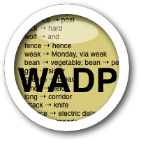

The Word Association Data Processor (WADP)
======================

*see the included manual_0.6.pdf for detailed information, including a tutorial*

*******
DESCRIPTION

The Word Association Data Processor (WADP) is an open-source, free software package which automates key aspects of the processing of word association data gathered from respondents in word association tests. Its user base is expected to be linguists and others working with word association data and employing a methodology similar to that presented in [Fitzpatrick et. al. (2015)](http://applij.oxfordjournals.org/content/36/1/23.full.pdf+html).

The WADP offers:

- a tidy and efficient interface for the manual categorisation of word association responses
- automatic categorisation of responses in cases where categorisations for the relevant cue-response pairs are found in a database of past category ratings
- automatic storage of all new ratings in the database
- tracking of respondent IDs and rater IDs (if provided) in all in- and output files
- automatic creation of individual response profiles
- automatic creation of cue profiles
and more. For full documentation, a tutorial as well as installation instructions, see the manual.

The WADP is cross-platform and currently available as beta software. It was
tested under OS X, Xubuntu Linux, and via Cygwin on Windows 7 and 8 and should work well on any platform that can run the bash shell.

*******
COMPATIBLE SYSTEMS

The WADP was tested on OS X (v. 10.12), Xubuntu (v. 14.04), Ubuntu (v. 16.04) and Cygwin under Windows 10. It should run on all platforms on which a bash shell is installed, which includes Windows with the [Cygwin](cygwin.com) package installed.[^1]
[^1]: The supplied WADP-installer and double-clickable launcher assume that Cygwin is installed in `C:\cygwin` which is the default location. For more information regarding Cygwin requirements, see the WADP manual.

*******
INSTALLATION

Using the supplied installers:

For OS X, Ubuntu, Xubuntu and Cygwin, installers are provided. Move the WADP folder onto the Desktop of your computer. Inside the WADP directory, double-click on `Ubuntu_Installer` (for Ubuntu), `Xubuntu_installer` (for Xubuntu), `OSX_installer` (OS X) or `Cygwin_installer`/`Cygwin64_installer` (for Cygwin regular and 64-bit installations).[^3]
[^3]: If the double-clickable installers fail to run (or when installing on other Linux/UNIX systems), open a terminal window and run the `install.sh` (inside the `src` folder) instead.
These installers replace previous versions of the installed files. It may be necessary to log out and log in again before the installation takes effect. It should now be possible to launch the WADP by double-clicking on the yellow WADP icon placed on the desktop in in the WADP directory. For further details, see the included manual.

*******
MANUAL

A manual detailing the operation of the WADP, including a tutorial, is supplied as a PDF document in the WADP directory.

*******
WRITTEN BY

Andreas Buerki, <buerkiA@cardiff.ac.uk>  

******
SPECIAL THANKS TO

Prof. Tess Fitzpatrick and Prof. Alison Wray

******
SEE ALSO

http://buerki.github.io/ngramprocessor/

http://buerki.github.io/SubString/

http://applij.oxfordjournals.org/content/36/1/23.full.pdf+html

*********
COPYRIGHT

Copyright 2015-17, Cardiff University
Licensed under the EUPL V.1.1. (the European Union Public Licence) which is an open-source licence (see the EUPL.pdf file for the full licence).

The project resides at [http://buerki.github.com/WADP/](http://buerki.github.com/WADP/) and new versions will be posted there. Suggestions and feedback are welcome. To be notified of new releases, go to https://github.com/buerki/WADP, click on the 'Watch' button and sign in.

*******
WARNING

As per article 7 of the EUPL, the WADP is a work in progress, which is continuously improved. It is not a finished work and may therefore contain defects or “bugs” inherent to this type of software development.
For the above reason, the software is provided under the Licence on an “as is” basis and without warranties of any kind concerning it, including without limitation merchantability, fitness for a particular purpose, absence of defects or errors, accuracy, non-infringement of intellectual property rights other than copyright as stated in Article 6 of the Licence.
This disclaimer of warranty is an essential part of the Licence and a condition for the grant of any rights to the WADP.
